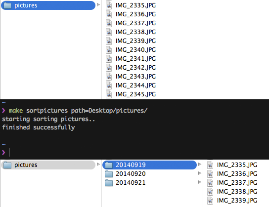

# My dotfiles

This is a collection of my dotfiles.

```
git clone git://github.com/justonestep/dotfiles ~/dotfiles
cd ~/dotfiles
./install/_install.sh
```

Now change the file `.gitconfig.user` in your home-folder and 
provide your git credentials, such as:

```
[user]
  name = Your name
  email = youremail@domain.de
[github]
  user = username
  token = 1235687641287364
```

Finally restart your terminal and vim again, and you are ready to go.

## VIM

I use a lot of plugins and custom syntaxes. They are all
installed via vundle - for a list of the plugins see vimrc.

To get things to work properly you first have to install
vundle - see the instructions here: [vundle](https://github.com/gmarik/vundle)

add in /etc/shells `/usr/local/bin/zsh`
and run in vim `:BundleInstall`

## MAKE

### sortpictures

Sorts pictures in several folders automatically by creation date.



Please use `make sortpictures` to start sorting.  
Optional you can pass several arguments:

* **path** to specify the folder containing the pictures (important: add an ending slash)
* **FORMAT** in terse form, the default format will be \`%Y%m%d\`

## MISC

* [vtop](http://parall.ax/vtop)
